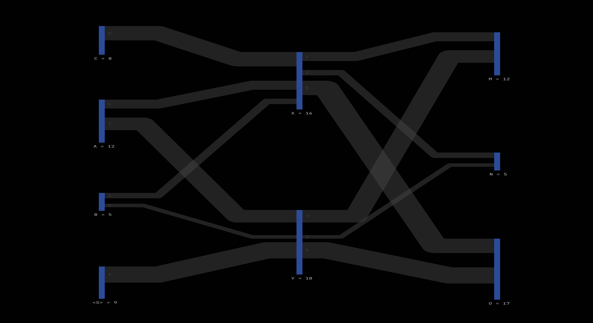

# Sankey Diagram

Visualize flows of amounts between different nodes.

## Features

* requires minimal flow specification
* optimized for legibility (tries to minimize flow crossings)
* minimal human intervention required (automatically generating missing nodes)
* simple implementation producing scalable SVG files

## Usage
```
from generate_sankey_svg import visualize

flows = [
    ("A", "X", 5),
    ("A", "Y", 7),
    ("B", "X", 3),
    ("B", "Y", 2),
    ("C", "X", 8),
    ("X", "M", 5),
    ("Y", "M", 7),
    ("X", "N", 3),
    ("Y", "N", 2),
    ("X", "O", 8),
    ("Y", "O", 9),
]

output_path = os.path.join("assets", "example.svg")
visualize(flows, output_path, default_colors)
```

## Dependencies

* [Bentley-Ottmann line intersection implementation](https://github.com/ideasman42/isect_segments-bentley_ottmann) by ideasman42